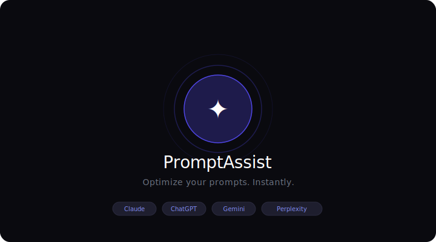
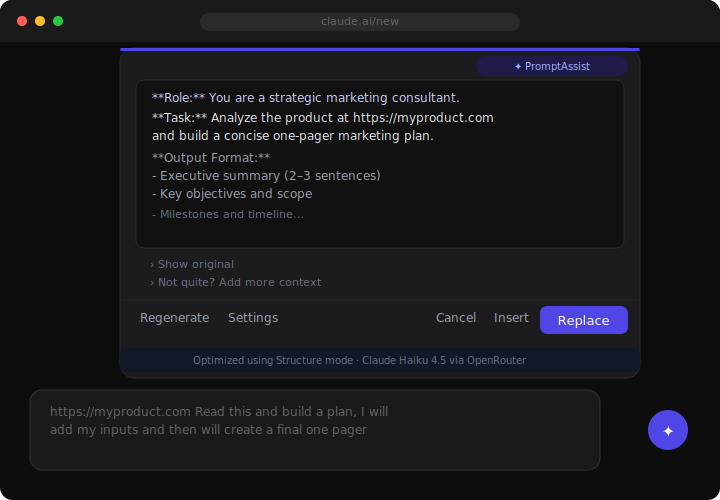
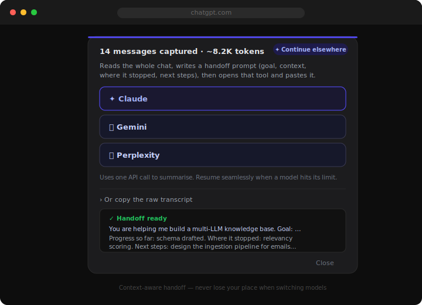
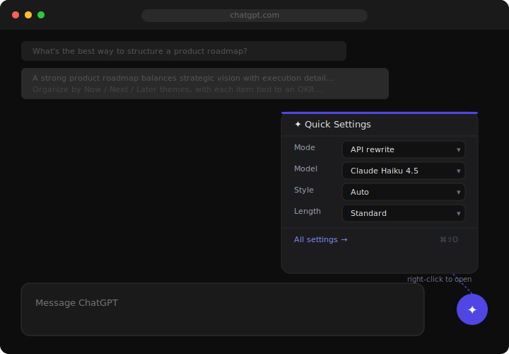
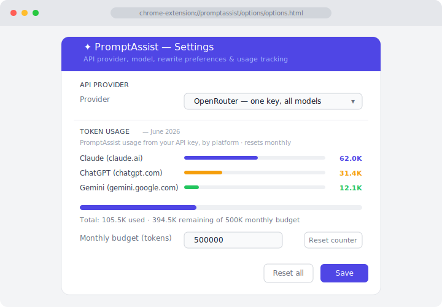
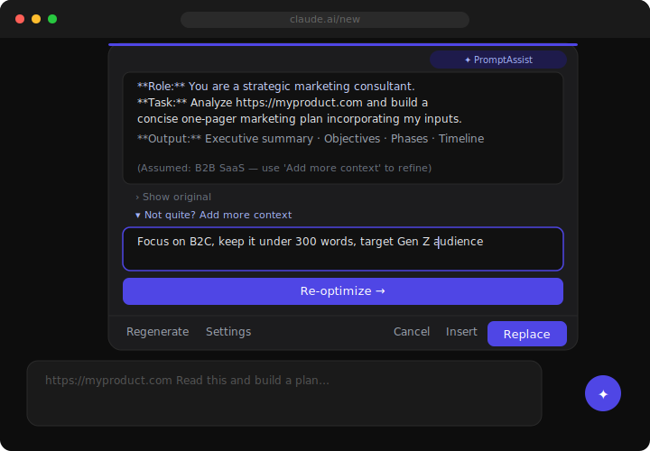

# PromptAssist

A Chrome extension that optimizes your AI prompts, tracks your usage across LLMs, and lets you hand off a conversation to another model without losing context — using prompt-engineering best practices from Anthropic, OpenAI, and Google.

<p align="center">
  
</p>

---

## Screenshots

<table>
  <tr>
    <td align="center" width="50%">
      
      <br/><sub><b>Optimized result panel</b></sub>
    </td>
    <td align="center" width="50%">
      
      <br/><sub><b>Context handoff — continue in another LLM</b></sub>
    </td>
  </tr>
  <tr>
    <td align="center" width="50%">
      
      <br/><sub><b>Quick settings + live usage badge</b></sub>
    </td>
    <td align="center" width="50%">
      
      <br/><sub><b>Per-platform token tracking</b></sub>
    </td>
  </tr>
  <tr>
    <td align="center" width="50%">
      
      <br/><sub><b>Inline refinement</b></sub>
    </td>
    <td align="center" width="50%">&nbsp;</td>
  </tr>
</table>

---

## Features

- **Instant rewrite** — click the floating ✦ button (or press `⌘/Ctrl + Shift + O`) to optimize any prompt in the text box
- **Two rewrite modes**
  - **Refine** — polishes short, clear prompts (fixes typos, sharpens clarity)
  - **Structure** — applies full prompt engineering for complex tasks (Role, Context, Task, Constraints, Output Format)
  - **Auto** — picks the right mode based on prompt length and complexity
- **Not quite right?** — inline "Add more context" refinement lets you tweak the rewrite without starting over
- **🔄 Context handoff** *(new)* — hit a model's limit? Export the whole conversation as a smart handoff prompt (goal, context, where it stopped, next steps) and continue seamlessly in another LLM. PromptAssist reads the full chat, summarizes it via one API call, then opens the target tool and pastes it in.
- **📊 Live usage tracking** *(new)*
  - An always-visible badge under the ✦ button shows your usage — no click needed
  - On **Claude**, reads your real **5-hour and 7-day** usage limits with reset countdowns
  - On every platform, shows the current conversation's **context-window** size
  - Per-platform monthly token tracking for PromptAssist's own API calls
- **Multi-provider API support** — OpenRouter, Anthropic, OpenAI, Google Gemini
- **Works on** — Claude, ChatGPT, Perplexity, Gemini, and most other text input fields
- **Dark mode** — fully themed to match the host page
- **Keyboard shortcut** — `⌘ Shift O` / `Ctrl Shift O`

---

## Installation

### From source (developer mode)

1. Download or clone this repository
2. Open Chrome and go to `chrome://extensions/`
3. Enable **Developer mode** (toggle in the top-right)
4. Click **Load unpacked**
5. Select the folder containing `manifest.json`

> Chrome Web Store submission coming soon.

---

## Setup

1. Click the PromptAssist icon in your Chrome toolbar
2. Click **All settings…**
3. Choose your **API Provider** (OpenRouter is recommended — one key for all models)
4. Paste your API key
5. Select a model and save

### Getting an API key

| Provider | URL | Key format |
|----------|-----|------------|
| OpenRouter (recommended) | [openrouter.ai/keys](https://openrouter.ai/keys) | `sk-or-…` |
| Anthropic | [console.anthropic.com](https://console.anthropic.com/settings/keys) | `sk-ant-…` |
| OpenAI | [platform.openai.com/api-keys](https://platform.openai.com/api-keys) | `sk-…` |
| Google | [aistudio.google.com/apikey](https://aistudio.google.com/apikey) | — |

---

## Usage

1. Go to any supported site (Claude, ChatGPT, Perplexity, Gemini, etc.)
2. Type your draft prompt in the chat input
3. Click the **✦** floating button, or press `⌘/Ctrl + Shift + O`
4. Review the optimized prompt in the overlay panel
5. Click **Replace** to swap your draft, or **Insert** to append below

### Refining the result

- Edit the text directly in the result panel
- Click **"Not quite? Add more context"** to give the model extra instructions and re-optimize
- Click **Regenerate** to run the optimization again from scratch

### Settings (open the ▾ menu on the floating button)

- **Mode** — API rewrite (uses your key) or In-chat rewrite (uses the page's own AI)
- **Style** — Auto / Refine / Structure
- **Length** — Concise / Standard / Detailed
- **Model** — choose from available models for your provider

### Continuing in another LLM (context handoff)

When you're running low on a model's limit and want to keep going elsewhere:

1. Open the ▾ menu → **Export chat**
2. Pick the target tool (Claude / ChatGPT / Gemini / Perplexity)
3. PromptAssist reads the entire conversation, writes a self-contained handoff prompt — **goal, key context & decisions, progress so far, where it stopped, and next steps** — then opens that tool and pastes it in, ready to send

> The handoff uses one API call with your configured model. Prefer the raw transcript instead? Use the "copy the raw transcript" option in the same dialog.

### Tracking your usage

- The badge under the ✦ button updates live. On **Claude** it shows your real 5h / 7d usage limits with reset timers; on other platforms it shows how full the current conversation's context window is.
- **All settings → Token usage** shows a per-platform breakdown of PromptAssist's own API consumption this month, with an adjustable monthly budget. Resets automatically on the 1st.

---

## Supported Sites

| Site | Status |
|------|--------|
| claude.ai | ✅ Full support |
| chatgpt.com | ✅ Full support |
| gemini.google.com | ✅ Full support |
| perplexity.ai | ✅ Full support |
| Other sites | ✅ Generic fallback (floating button only) |

---

## Privacy & Security

- **Your API key never leaves your browser** — all API calls are made directly from the extension to the provider
- **No backend server** — the extension has no server component; everything runs locally
- **Keys stored in `chrome.storage.local`** — isolated to this extension, not accessible by web pages
- **Usage data stays local** — usage limits are read from the platform's own responses on the page and only ever displayed in the badge; nothing is sent anywhere
- **No analytics or tracking** of any kind
- **Content Security Policy** enforced on all extension pages

---

## Development

```
PromptAssist/
├── manifest.json          # Extension manifest (MV3)
├── background/
│   └── service-worker.js  # API calls, handoff generation, token tracking
├── content/
│   └── content.js         # Floating button, overlay UI, site adapters, usage badge
├── inject/
│   └── bridge.js          # MAIN-world fetch interceptor (real usage data)
├── popup/
│   ├── popup.html
│   └── popup.js           # Quick settings popup
├── options/
│   ├── options.html
│   └── options.js         # Full settings page + per-platform usage
├── chunks/
│   └── settings-DQva-Qam.js  # Shared settings/storage helpers
└── icons/
```

### Architecture notes

- **Manifest V3** service worker — no persistent background page
- Content script is a **self-contained IIFE** (no ES module imports) — shared logic is duplicated between `service-worker.js` and `content.js` intentionally
- UI rendered in a **Shadow DOM** — fully isolated from host page styles
- Site adapters in `content.js` — each supported site has a small adapter implementing `findInput()`, `getValue()`, `setValue()`, `submit()`, `waitForReply()`, `readPlatformQuota()`
- `inject/bridge.js` runs in the page's **MAIN world** to read real usage/token data from the platform's own API responses, then relays it to the content script via `postMessage`

---

## Contributing

Pull requests are welcome. For major changes, please open an issue first.

1. Fork the repo
2. Create a feature branch (`git checkout -b feature/my-feature`)
3. Commit your changes (`git commit -m 'Add my feature'`)
4. Push to the branch (`git push origin feature/my-feature`)
5. Open a Pull Request

---

## License

[MIT](LICENSE) © 2026 Shubham
